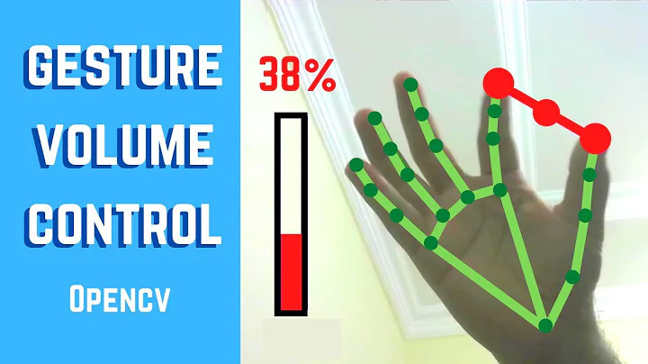

# Gesture Volume Control 🎛️✋

This project allows you to control your system's volume using hand gestures, leveraging computer vision and machine learning techniques. The application uses a webcam to detect hand movements and adjusts the volume accordingly.

---

## Features 🚀
- **Hand Tracking**: Detects and tracks your hand in real-time using MediaPipe.
- **Gesture Recognition**: Measures the distance between your thumb and index finger to control the volume.
- **Real-Time Feedback**: Displays the current volume level and FPS on the screen.
- **Interactive UI**: Visualizes hand landmarks and gestures with dynamic graphics.

---

## Demo 🎥


---

## Installation 🛠️

1. Clone the repository:
   ```bash
   git clone https://github.com/yourusername/Gesture-Volume-Control.git
   cd Gesture-Volume-Control
   ```

2. Create and activate a virtual environment:
   ```bash
   python -m venv venv
   source venv/bin/activate  # On Windows: venv\Scripts\activate
   ```

3. Install the dependencies:
   ```bash
   pip install -r requirements.txt
   ```

4. Run the application:
   ```bash
   python main.py
   ```

---

## Requirements 📋
- Python 3.7+
- Webcam
- Libraries:
  - OpenCV
  - MediaPipe
  - NumPy
  - Pycaw
  - Comtypes

---

## How It Works 🧠
1. **Hand Detection**: The application uses MediaPipe to detect and track hand landmarks.
2. **Gesture Calculation**: The distance between the thumb and index finger is calculated to determine the desired volume level.
3. **Volume Adjustment**: The Pycaw library is used to adjust the system's master volume based on the gesture.

---

## Controls 🎮
- **Adjust Volume**: Move your thumb and index finger closer or farther apart.
- **Quit Application**: Press the `q` key.

---

## File Structure 📂
```
Gesture-Volume-Control/
├── HandTrackingModule.py   # Custom module for hand tracking
├── main.py                 # Main application script
├── requirements.txt        # Project dependencies
├── .gitignore              # Git ignore file
├── img/                    # Folder containing images
│   └── cover.png           # Demo cover image
└── README.md               # Project documentation
```

---

## Known Issues 🐞
- The application may not work well in low-light conditions.
- Hand detection accuracy may vary depending on the webcam quality.

---

## Future Improvements 🌟
- Add support for more gestures.
- Implement multi-hand tracking.
- Enhance UI with additional visual feedback.

---

## Contributing 🤝
Contributions are welcome! Feel free to fork the repository and submit a pull request.

---

## License 📜
This project is licensed under the MIT License. See the [LICENSE](LICENSE) file for details.

---

## Acknowledgments 🙌
- [MediaPipe](https://mediapipe.dev/) for hand tracking.
- [Pycaw](https://github.com/AndreMiras/pycaw) for audio control.
- OpenCV and NumPy for image processing.

---

Enjoy controlling your volume with gestures! ✋🎶